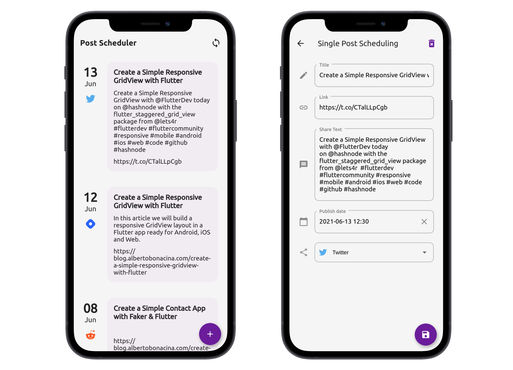

# HarperDB Hashnode Hackathon

This is a Flutter project made for the [Hashnode Hackathon](https://townhall.hashnode.com/announcing-harperdb-hackathon-on-hashnode) in collaboration with [HarperDB](https://harperdb.io/). 

The app is a Post Schedule app used to managing the release schedule of your blog post on Hashnode, when post them and when share posts on other platforms like Reddit, Twitter, Facebook, etc. The app is build with Flutter 2.2 and it's ready for Android, iOS and Web, the result look like

